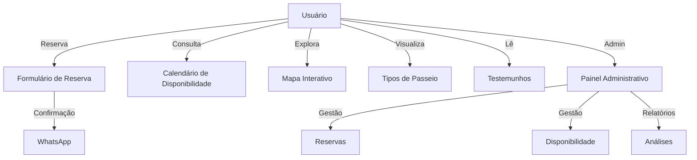

# TukTuk Milfontes

Plataforma web para reservas e gestão de passeios de tuk-tuk em Vila Nova de Milfontes.

## Funcionalidades Principais

- **Página inicial** com apresentação dos passeios, preços, destaques turísticos e depoimentos de clientes.
- **Reserva online**: formulário intuitivo, integração direta com WhatsApp para confirmação rápida e consulta de disponibilidade em tempo real.
- **Tipos de passeio**: panorâmico, praia das Furnas, travessia da ponte, pôr do sol, noturno e rota dos pescadores.
- **Gestão administrativa**: área de login para administradores, painel para gerir reservas, calendário de disponibilidade e relatórios (em desenvolvimento).
- **Mapa interativo** com pontos de interesse turísticos.
- **Multilingue**: suporte a vários idiomas (Português, Inglês, Espanhol, Francês, Alemão, Holandês, Italiano).
- **Preços transparentes** e exemplos de cálculo.
- **Informações de contacto** e destaques como seguro e fotos incluídos.

## Funcionalidades

- **Reservas online de passeios de Tuk Tuk:** Permite ao utilizador reservar facilmente um passeio, escolhendo data, hora e número de pessoas, com confirmação via WhatsApp.
- **Mapa interativo com pontos de interesse:** Visualize no mapa os principais pontos turísticos, praias, restaurantes, alojamentos e atividades de Milfontes, com descrições em vários idiomas.
- **Calendário de disponibilidade:** Consulte em tempo real os horários disponíveis para reservas, evitando conflitos e sobreposições.
- **Painel administrativo:** Área exclusiva para administradores, com login, gestão de reservas, visualização de calendário e lista de clientes.
- **Internacionalização (PT, EN, ES, FR, DE, IT, NL):** Toda a aplicação pode ser utilizada em 7 idiomas, com tradução automática dos conteúdos e dos pontos de interesse.
- **Preços transparentes:** Tabela de preços clara, exemplos de cálculo e simulação de valores para diferentes tipos de passeio e número de pessoas.
- **Testemunhos de clientes:** Secção com avaliações reais de clientes, para aumentar a confiança dos novos utilizadores.
- **FAQ (Perguntas Frequentes):** Respostas às dúvidas mais comuns sobre os passeios, reservas, segurança e condições.
- **Contactos e integração WhatsApp:** Botão para contacto direto via WhatsApp, telefone e email.
- **Acessibilidade e responsividade:** Interface adaptada a dispositivos móveis, tablets e desktop, com navegação intuitiva.

## Tecnologias Utilizadas

- **Frontend:** React + Vite + TailwindCSS
- **Backend:** Supabase (reservas e autenticação)
- **Integração:** WhatsApp para confirmação de reservas
- **Internacionalização:** i18next

## Como rodar localmente

1. **Pré-requisitos:**

   - Node.js 18.x LTS
   - npm

2. **Instalação:**

   ```sh
   npm install --legacy-peer-deps
   ```

3. **Executar em modo desenvolvimento:**

   ```sh
   npm run dev
   ```

4. **Acessar:**

## Licença

5. **Configuração do Supabase (opcional):**
   - Para funcionalidades completas, configure as variáveis de ambiente `VITE_SUPABASE_URL` e `VITE_SUPABASE_ANON_KEY`.
   - Caso não configure, o sistema funciona em modo demonstração com dados mock.

## Diagrama de Funcionalidades



## Contato

- WhatsApp: 968 784 043
- Email: (adicione aqui)

---

© 2024 TukTuk Milfontes. Todos os direitos reservados.
criado por Carlos Barradas.
